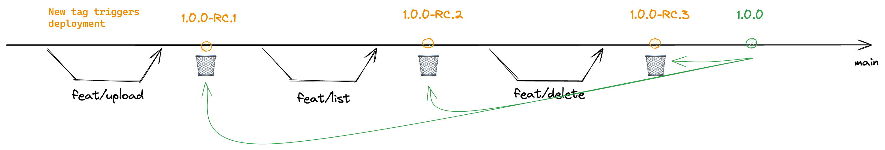

## Branching Stategy

Due to the simplicity of the project, Trunk-Based Development has been selected as the development strategy: [Trunk-Based Development](https://trunkbaseddevelopment.com/).

This approach also offers flexibility for future adjustments. If the project becomes more complex, we can easily transition to a release-flow model if needed: [Release Flow](https://trunkbaseddevelopment.com/).

Each time a new tag is created, a build workflow is triggered. We can imagine a gitops approach following this automation to deploy automaticaly the new image, using Argocd.

## Local Test

### Server

### Client

## Deployment

