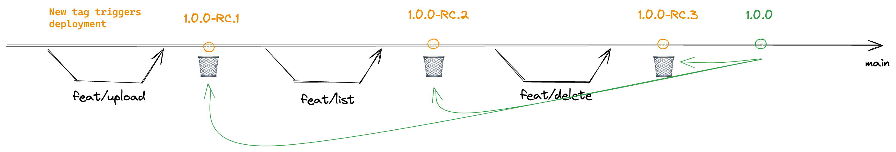

## Branching Stategy



Due to the simplicity of the project, Trunk-Based Development has been selected as the development strategy: [Trunk-Based Development](https://trunkbaseddevelopment.com/).

This approach also offers flexibility for future adjustments. If the project becomes more complex, we can easily transition to a release-flow model if needed: [Release Flow](https://trunkbaseddevelopment.com/).

Each time a new tag is created, a build workflow is triggered. We can imagine a gitops approach following this automation to deploy automaticaly the new image, using Argocd.


## Server

### *docker*

```bash
docker build -t wobucket:latest . && docker run -p 8080:8080  wobucket:latest
```

or

```bash
docker run -p 8080:8080 --platform linux/amd64  antonkad/wobucket:1.0.0
```

### *golang cli*

make sur to have go installed

```bash
go mod tidy
go run .
```

## Client

```bash
python3 wb.py list
python3 wb.py up -f ../Readme.md
python3 wb.py remove Readme.md

python3 wb.py -url "<URL>" list
```

## Deployment

## How to use this deployment chart 

This is a github template aimed to me copied in order to deploy your microserices on a kubernetes cluster. It's strongly recommended to use these alongide ArgoCD deployment tool.

When using helm chart deployment, you've got one file (values.yaml) to modify in order to describe how you want your microservice to be deployed. However, most generaly you'll have to deploy you microservice maybe in multiple environment or even multiple time for various countries.

Here we propose a structure in order to manage easily multiple environments:
- common: as it tells itselfs, you put here all agnostic configuration.
- envs: depending on you're folder structure, you'll have here configuration that can first be dedicated to envs such as dev, qlf, prod. But also to countries 
- variants: holds common characteristics between environments. For example, we can have variants for all prod and non-prod environments and also the regions. 

```sh
helm template my-release  -f common/values-api-external.yaml -f variants/values-non-prod.yaml -f envs/country/qlf/values-api-external.yaml .
```
